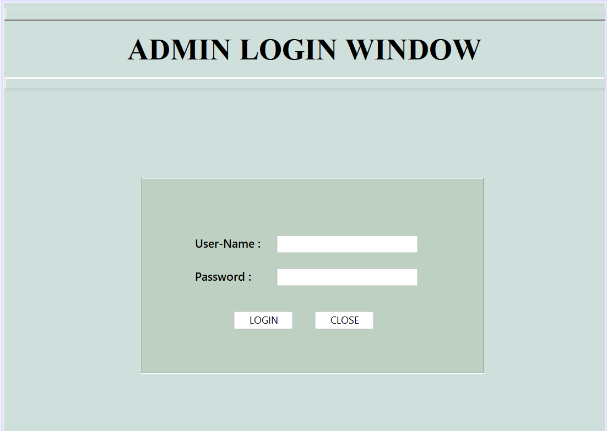
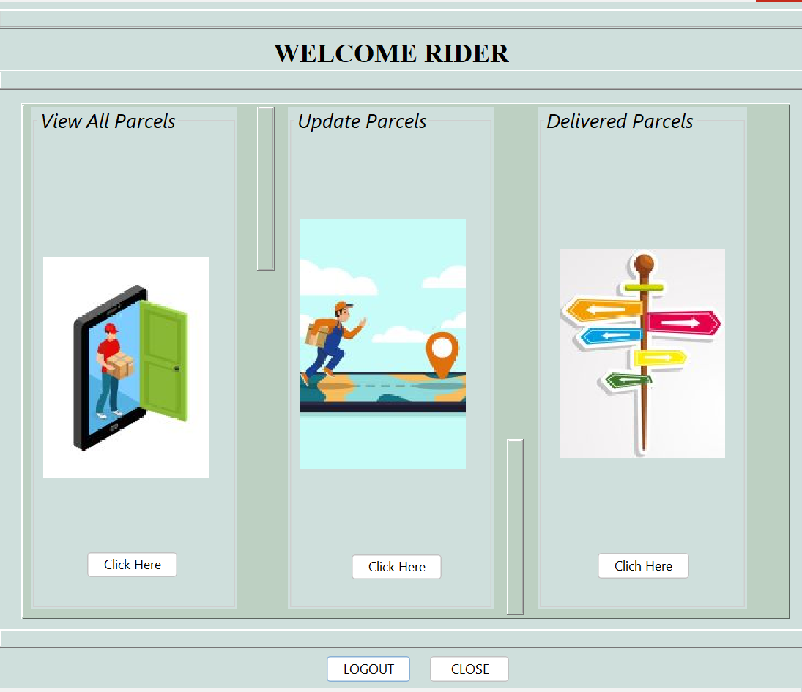
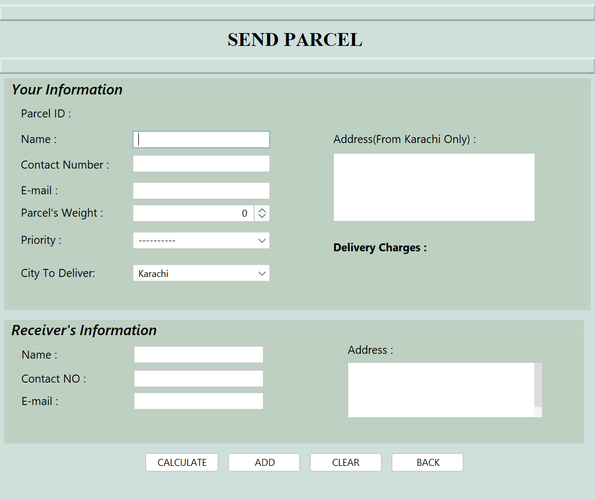
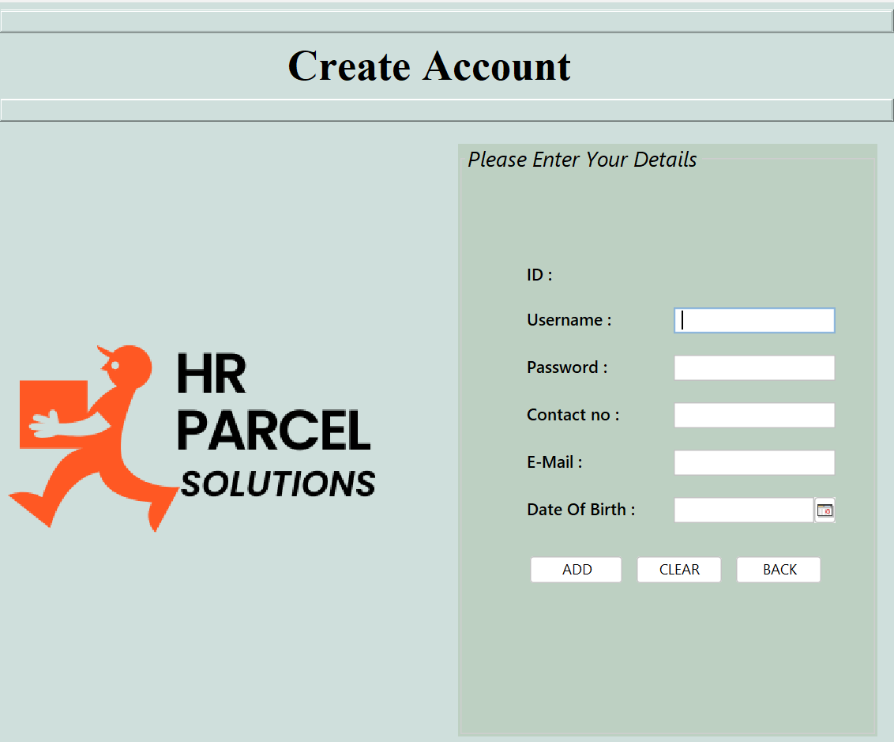

# Smart Parcel Management System

A Java Swing-based desktop application for managing parcel deliveries, integrated with a MySQL database.

## 🚀 Features

- Admin & User authentication
- Add, update, delete parcels
- Parcel history & status tracking
- Rider management
- GUI built using Java Swing
- MySQL database with JDBC integration

## 🧰 Tech Stack

- Java (Swing)
- MySQL
- JDBC

## 📷 Screenshots

### Login Pages
 
 
 
 ### Dashboard
 
 
 
 ### Add Parcel Form
 
 
 ### SignUp Pages
 
 
## ⚙️ How to Run

1. Clone the repo or download the ZIP.
2. Open in NetBeans or IntelliJ.
3. Import `database.sql` in your MySQL server.
4. Update DB credentials in `DBConnection.java`.
5. Run `Main.java`.

## 🗃️ Database

You can provide a file like `database.sql` containing table creation and test data.

## 📝 License

MIT License
